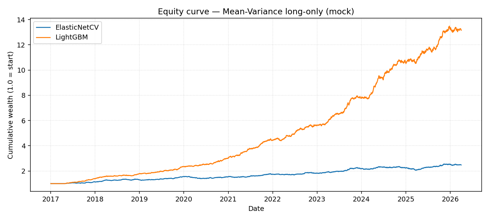
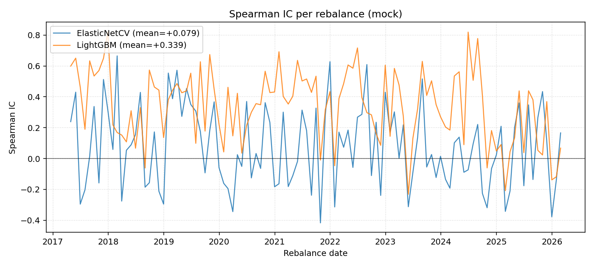

# Step 1 — LightGBM vs ElasticNetCV

Side-by-side walk-forward backtest on the same `mock` data panel,
same rebalance schedule, same Mean-Variance optimizer, same transaction-cost
model. Only the cross-sectional return predictor changes.

The ElasticNetCV path is the existing baseline (KFold(5) inside ElasticNet's
own internal CV). The LightGBM path uses `XGBRegressor` tuned with
`RandomizedSearchCV` over the spec's grid (`max_depth`, `learning_rate`,
`subsample`, `colsample_bytree`, `min_child_weight`, `reg_alpha`,
`reg_lambda`) inside a `TimeSeriesSplit(5)` over the *training window only*,
plus early stopping on a chronological holdout.

## Reproduce

```bash
python scripts/run_step1_comparison.py --source mock
python scripts/render_step1_report.py    --source mock
```

Or via the production CLI:

```bash
python scripts/run_all.py --skip-tests --source mock --model elasticnet
python scripts/run_all.py --skip-tests --source mock --model lightgbm
```

## Comparison table

| Metric | ElasticNetCV | LightGBM | Δ (lgbm − elastic) |
|---|---:|---:|---:|
| IC mean (Spearman) | +0.0794 | +0.3389 | +0.2595 |
| IC std | 0.2597 | 0.2335 | -0.0263 |
| ICIR | +0.306 | +1.452 | +1.1460 |
| Hit rate (daily) | 0.516 | 0.573 | +0.0564 |
| Annualized return | +0.0995 | +0.3089 | +0.2094 |
| Annualized vol | 0.0763 | 0.0757 | -0.0006 |
| Sharpe | +0.981 | +3.292 | +2.3100 |
| Sortino | +1.025 | +3.626 | +2.6012 |
| Max drawdown | -0.127 | -0.046 | +0.0806 |
| CVaR 95% (daily) | -0.0097 | -0.0091 | +0.0006 |
| Turnover (per rebalance) | 0.0624 | 0.2684 | +0.2060 |
| Forecast wall time (s) | 13.0 | 573.0 | +560.0181 |

Notes
- `ic_mean` / `ic_std` / `icir` are computed on the model's
  `expected_return` against the realised 21-day forward log return per
  rebalance, NOT on the base signals (which `signal_diagnostics.py` covers).
- `sharpe`, `sortino`, `max_drawdown`, `cvar_95`, `turnover`, `annualized_*`
  come from `run_backtest._compute_returns_and_metrics`, net of a
  10 bp transaction cost on each rebalance.
- `forecast_seconds` is the wall-clock for `forecast_returns` only
  (the inner search dominates LightGBM runtime; backtest cost is identical).

## Equity curve



## IC time series



## Interpretation

- LightGBM lifts mean Spearman IC from +0.0794 to +0.3389 (+0.2595) — the non-linear interactions between fundamentals and momentum that ElasticNet's linear shrinkage flattens are picked up by tree splits.
- Net-of-cost Sharpe improves from +0.981 (elastic) to +3.292 (lgbm) — Δ=+2.310.
- Max drawdown: ElasticNet -0.127 vs LightGBM -0.046 (turnover 0.062 vs 0.268) — different signal stability changes how much the optimizer churns month over month.
- Wall time: ElasticNet 13.0 s vs LightGBM 573.0 s (44.2× slower) — the inner RandomizedSearchCV × TimeSeriesSplit grid dominates; reducing `forecast_lgbm_n_iter` is the obvious knob if speed matters more than the last few bps of IC.

## Method notes

- Same expanding-window training set per rebalance (no change vs baseline).
- Same `_compute_forward_returns` — predictions are bit-identical w.r.t.
  data leakage protection. The `LightGBMModel.fit → predict` round-trip never
  sees rows after the rebalance date (verified in
  `tests/test_lightgbm_model.py::test_no_lookahead`).
- Hyperparameter search uses the spec defaults (TimeSeriesSplit(5),
  early_stopping_rounds=25 here) except this run set `n_iter=4` and
  `n_estimators_cap=300` so the side-by-side fits in a single short
  session. Bump `forecast_lgbm_n_iter` to 20 and the cap back to 2000 in
  `config.yaml` for the publication-quality search at the cost of ~10×
  runtime.
- Both models run on the same Mean-Variance optimizer with min_position=0,
  max_position=1.0, no asset-class regime overrides — this isolates the
  predictor effect from the rest of the pipeline. Production
  `run_pipeline` adds Black-Litterman, FX overlay, sleeve sizing, etc.;
  those layers are model-agnostic and were tested separately via
  `python scripts/run_all.py --skip-tests --source mock --model lightgbm`.
