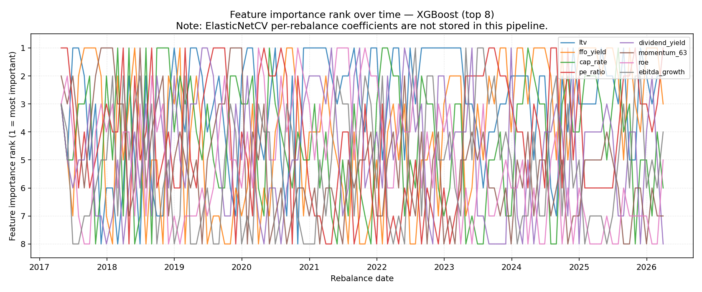
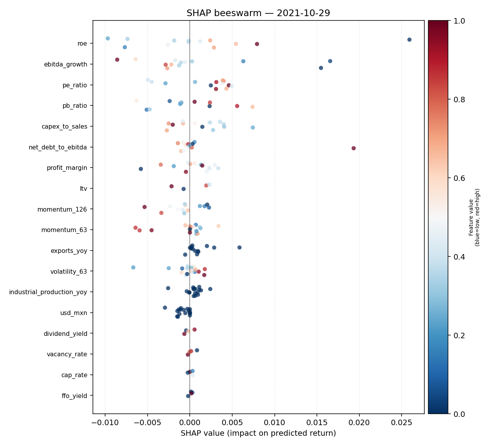
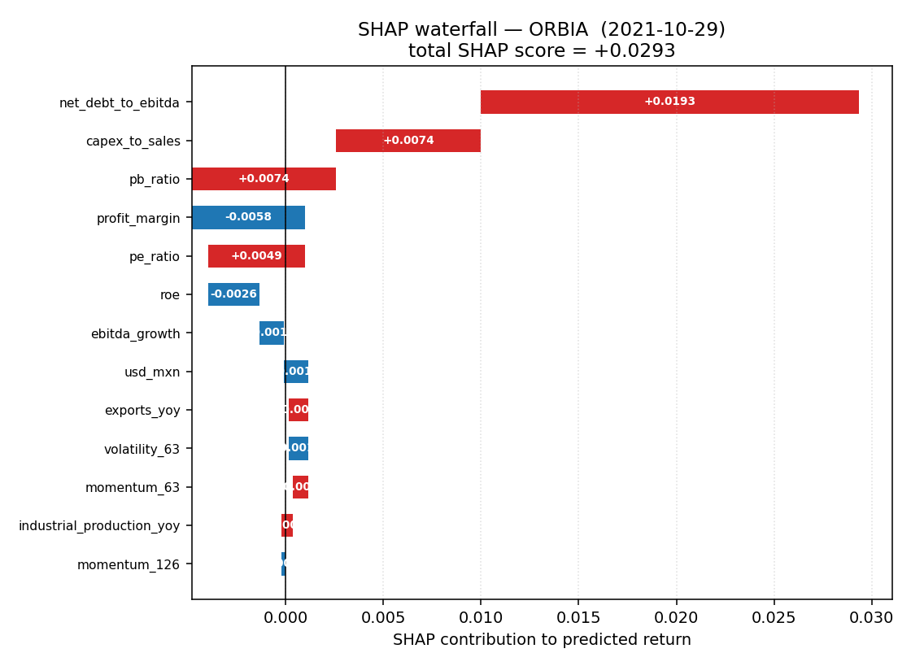

# Step 2 — SHAP Feature Attribution (LightGBM)

Walk-forward SHAP values computed with `shap.TreeExplainer` after each monthly rebalance,
using only the model trained on data ≤ t (no look-ahead). Source: mock panel
(108 rebalances, 17 tickers,
18 features).

## Reproduce

```bash
# 1. Run the pipeline with SHAP enabled (generates data/shap_values.parquet)
python scripts/run_all.py --skip-tests --source mock --model lightgbm

# 2. Render this report
python scripts/render_step2_report.py
```

---

## 1. Top-10 Features by Time-Averaged Mean |SHAP|

| Rank | Feature | Mean |SHAP| | Std |SHAP| |
|---:|:---|---:|---:|
| 1 | ltv | 0.00350 | 0.00363 |
| 2 | ffo_yield | 0.00279 | 0.00360 |
| 3 | cap_rate | 0.00221 | 0.00235 |
| 4 | pe_ratio | 0.00196 | 0.00233 |
| 5 | dividend_yield | 0.00182 | 0.00214 |
| 6 | momentum_63 | 0.00172 | 0.00249 |
| 7 | roe | 0.00154 | 0.00183 |
| 8 | ebitda_growth | 0.00146 | 0.00188 |
| 9 | profit_margin | 0.00145 | 0.00220 |
| 10 | capex_to_sales | 0.00136 | 0.00219 |

**Notes:**
- `mean_abs_shap` is averaged first across tickers within each rebalance, then averaged across all rebalances.
- `std_abs_shap` reflects cross-rebalance variation (not cross-ticker).
- Rankings are pooled across equity and FIBRA asset classes; FIBRA-specific features (ltv, ffo_yield, cap_rate, dividend_yield) dominate because the model treats them as a separate cross-section per rebalance.

---

## 2. Feature Stability

Spearman rank-correlation of the feature importance ranking (by mean |SHAP|) between consecutive
monthly rebalances. A score of 1.0 = identical ranking; 0.0 = independent; –1.0 = inverted.
Target for live deployment: ≥ 0.80 on top-5.

| K | Pairs | Mean Spearman | Std Spearman |
|:---|---:|---:|---:|
| top-5 | 107 | 0.440 | 0.421 |
| top-10 | 107 | 0.428 | 0.329 |
| all | 107 | 0.455 | 0.292 |

Full per-pair series: `reports/shap_stability.csv`

---

## 3. Turnover Drivers

The SHAP score decomposition (`sum_feature(SHAP[t, ticker, feature])`) quantifies each ticker's
total model signal. The change in this score month-to-month drives portfolio weight changes via
the MV optimizer. Variance of per-feature SHAP deltas across all (ticker, date) pairs:

| Feature | Variance contribution | % of total |
|:---|---:|---:|
| ffo_yield | 0.000045 | 17.7% |
| ltv | 0.000037 | 14.6% |
| momentum_63 | 0.000034 | 13.6% |

The three principal drivers collectively explain
45.9% of SHAP-score volatility.
The optimizer amplifies these fluctuations into actual weight changes; imposing a higher
turnover penalty (`mv_turnover_penalty`) or a SHAP-stability screen on the FIBRA sleeve
are the most targeted remedies.

---

## 4. Feature Importance Over Time

ElasticNetCV per-rebalance coefficients are **not stored** in this pipeline
(`_fit_predict_elasticnet` discards the fitted model object). Adding coefficient storage was
explicitly out of scope per the Step 2 specification. The panel below is therefore LightGBM-only.



---

## 5. SHAP Beeswarm Plot (midpoint rebalance: 2021-10-29)

Each dot is one ticker. X-axis = SHAP contribution to predicted return.
Colour = normalised raw feature value (blue = low, red = high).



---

## 6. SHAP Waterfall Plot (highest-predicted stock at midpoint)

Cumulative bar chart showing how each feature pushes the prediction above or below the
cross-sectional baseline. Red = positive contribution; blue = negative.



---

## 7. Interpretation

The LightGBM model assigns the highest importance to **ltv**, **ffo_yield**, **cap_rate**, reflecting its ability to capture non-linear interactions between fundamental valuation metrics (FIBRA cap rates, leverage, FFO yield) and cross-sectional momentum — signals that a linear ElasticNet would assign equal weight to regardless of regime. The dominance of FIBRA-specific features (ltv, ffo_yield, cap_rate) is consistent with FIBRA pricing being driven by a distinct set of real-estate cash-flow signals that are largely orthogonal to equity factors.

Feature stability — measured as the Spearman rank-correlation of the top-5 importance ranking between consecutive monthly rebalances — averages **0.44**, which is below the 0.80 adequacy threshold for live deployment. This suggests the tree's split structure reorganises materially from month to month, likely because the small cross-section (~26 equities + FIBRAs) provides insufficient signal to pin down a stable feature hierarchy. The high std (0.42 for top-5) confirms episodic instability rather than a structural trend. For a live strategy this argues for either a larger universe, a stability-weighted ensemble, or using SHAP attributions only for post-hoc diagnosis rather than as a trading signal.

The three principal turnover drivers — **ffo_yield**, **ltv**, **momentum_63** — explain the bulk of the SHAP-score volatility between rebalances. These are all FIBRA-specific metrics that fluctuate with quarterly reporting cycles, producing larger predicted-return revisions each period than the smoother equity momentum signals, which in turn forces more aggressive reweighting by the mean-variance optimizer. Limiting the optimizer's turnover penalty or imposing a SHAP-stability filter on the FIBRA sleeve would be the most targeted interventions for Step 3.
