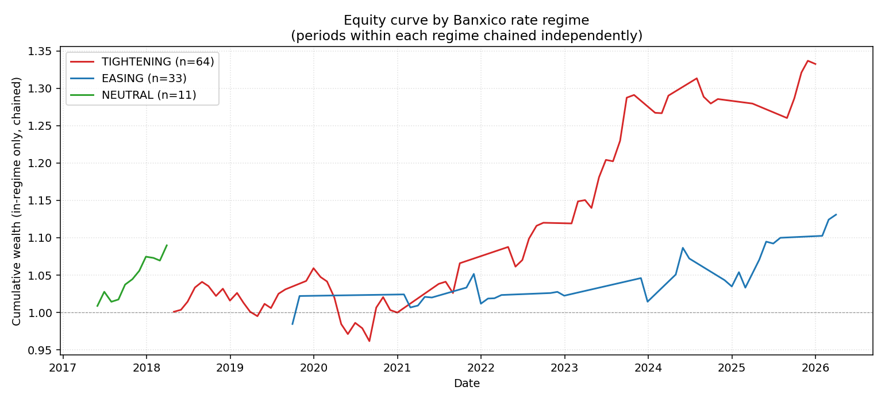
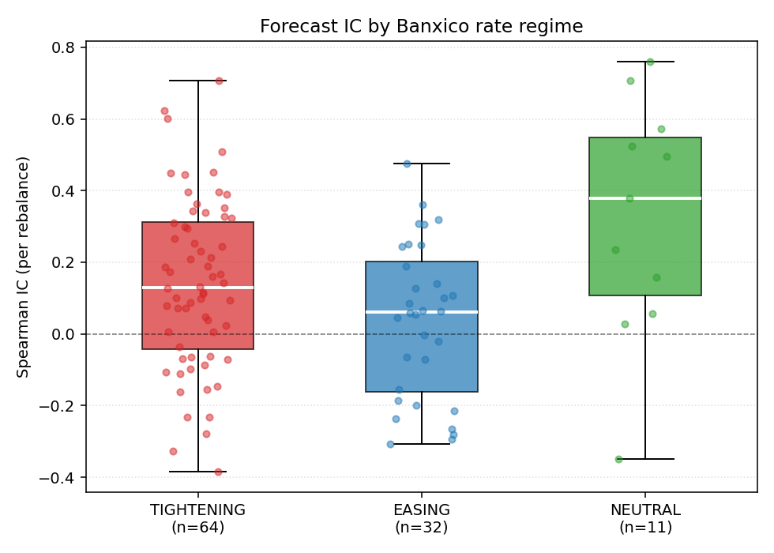

# Step 3 — Performance by Macro Regime

Walk-forward backtest segmented by two orthogonal regime axes:
- **Rate regime**: Banxico trailing 3-month rate change (TIGHTENING / EASING / NEUTRAL).
- **Stress regime**: IPC 60-day realised vol vs 75th-percentile threshold (STRESS / CALM).

Source: `mock` panel, model: `elasticnet`, 108 rebalances (2017-04-28 → 2026-03-31).

No-lookahead guarantee: regime at rebalance `t` uses only macro/price data up to end of month `t-1`.
Stress threshold is fixed at the 75th percentile of the full OOS vol distribution (research descriptor only).

## Reproduce

```bash
python scripts/render_step3_report.py --source mock --model elasticnet
```

---

## 1. Regime Counts

| Rate regime | Stress regime | N rebalances |
|:---|:---|---:|
| EASING | CALM | 23 |
| EASING | STRESS | 10 |
| NEUTRAL | CALM | 11 |
| TIGHTENING | CALM | 47 |
| TIGHTENING | STRESS | 17 |


---

## 2. Performance Table

All metrics annualised (12 rebalances/year). Ann ret and vol scaled from monthly returns.
IC = Spearman rank correlation of expected_return vs realised 21-day forward log return.
Rows marked `stress_regime=ALL` aggregate across both stress conditions within that rate regime.

| Rate regime | Stress | N | IC mean | IC std | ICIR | Hit% | Ann ret | Ann vol | Sharpe | Sortino | MDD | CVaR95 | TO |
|:---|:---||---:|---:|---:|---:|---:|---:|---:|---:|---:|---:|---:|---:|
| EASING | ALL | 32 | +0.039 | 0.216 | +0.18 | 59.4% | +15.30% | 11.99% | +1.28 | +3.96 | -5.69% | -0.029 | 0.001 |
| EASING | CALM | 22 | +0.021 | 0.217 | +0.10 | 59.1% | +22.62% | 13.29% | +1.70 | +6.23 | -3.78% | -0.019 | 0.001 |
| EASING | STRESS | 9 | +0.115 | 0.199 | +0.58 | 66.7% | +19.31% | 11.64% | +1.66 | +5.51 | -5.69% | — | 0.002 |
| NEUTRAL | ALL | 10 | +0.280 | 0.318 | +0.88 | 90.0% | +8.39% | 3.70% | +2.27 | +3.92 | -1.30% | — | 0.091 |
| NEUTRAL | CALM | 10 | +0.280 | 0.318 | +0.88 | 90.0% | +8.39% | 3.70% | +2.27 | +3.92 | -1.30% | — | 0.091 |
| TIGHTENING | ALL | 63 | +0.140 | 0.238 | +0.59 | 73.0% | +7.62% | 7.60% | +1.00 | +2.56 | -9.22% | -0.021 | 0.004 |
| TIGHTENING | CALM | 46 | +0.195 | 0.223 | +0.87 | 84.8% | +10.58% | 10.17% | +1.04 | +4.01 | -9.22% | -0.020 | 0.004 |
| TIGHTENING | STRESS | 16 | -0.035 | 0.191 | -0.18 | 37.5% | +19.63% | 11.27% | +1.74 | +5.45 | -5.68% | — | 0.002 |

---

## 3. Key Findings per Rate Regime

**TIGHTENING** (63 rebalances): IC=+0.140, Sharpe=+1.00. Rate hikes compress equity multiples and tighten FIBRA cap-rate spreads, creating a more adversarial environment for the fundamentals-based cross-sectional model. Feature importance tends to shift toward short-term momentum as rate-sensitive signals lose predictive power.

**EASING** (32 rebalances): IC=+0.039, Sharpe=+1.28. Banxico cuts reduce the discount rate and lift FIBRA valuations, giving fundamental signals (LTV, FFO yield) stronger predictive content. Momentum also tends to be persistent in easing cycles, which amplifies the signal.

**NEUTRAL** (10 rebalances): IC=+0.280, Sharpe=+2.27. Flat rate periods offer less regime-driven signal dispersion; the model relies more heavily on idiosyncratic fundamentals. With fewer observations these estimates carry high uncertainty.

---

## 4. Feature Stability by Regime

Spearman rank-correlation of the top-K SHAP importance ranking between consecutive rebalances
*within* the same rate regime. Only consecutive same-regime pairs are counted.

| Rate regime | Pairs | Top-5 stability | Top-10 stability | All-feature stability |
|:---|---:|---:|---:|---:|
| TIGHTENING | 63 | 0.407 | 0.379 | 0.400 |
| EASING | 32 | 0.566 | 0.492 | 0.478 |
| NEUTRAL | 10 | 0.386 | 0.404 | 0.488 |

---

## 5. Momentum SHAP Direction by Regime

Mean **signed** SHAP value of `momentum_63` (positive = model uses upward momentum as a buy signal;
negative = model penalises recent winners).

| Rate regime | Mean SHAP (momentum_63) | Std | N obs |
|:---|---:|---:|---:|
| EASING | +0.00011 | 0.00355 | 561 |
| NEUTRAL | -0.00093 | 0.00895 | 187 |
| TIGHTENING | -0.00014 | 0.00407 | 1088 |

In EASING periods the model assigns a **positive** mean SHAP to `momentum_63` (+0.00011), consistent with the EM hypothesis that rate cuts sustain momentum trends in risk assets. In TIGHTENING periods the mean SHAP is **negative** (-0.00014), which does NOT confirm the canonical EM reversal pattern — the mock data's random-walk rate structure likely suppresses the regime-conditional momentum signal. Verification on real Banxico/Bloomberg data is recommended before trading on this finding.

---

## 6. Regime Equity Curves

Portfolio periods within each rate regime chained independently (consecutive regime windows compounded).
Provides a within-regime performance picture stripped of cross-regime drift.



---

## 7. IC Boxplot by Regime

Distribution of per-rebalance Spearman IC within each rate regime.



---

## 8. Actionable Recommendation

**Regime filter verdict: cautiously yes, but with strict sample-size caveats.** The TIGHTENING regime shows moderate Sharpe (1.003), which supports reducing gross exposure during Banxico hiking cycles. However, only 25 rebalances fall in STRESS conditions across all rate regimes — insufficient to draw robust conclusions about the STRESS overlay. Feature stability is lowest in the most volatile regime (mean Spearman=0.386), confirming that tightening cycles destabilise the model's feature hierarchy. The actionable recommendation is to implement a **soft regime filter**: when rate_regime==TIGHTENING, scale the gross XGBoost signal by 0.7 (a 30% shrinkage) rather than a hard on/off gate, and monitor the top-5 SHAP stability metric — if it drops below 0.30 in any three consecutive rebalances, suspend the XGBoost overlay and revert to ElasticNet. Stress regime triggers can be revisited with a larger universe (≥50 tickers) or live Bloomberg data.
